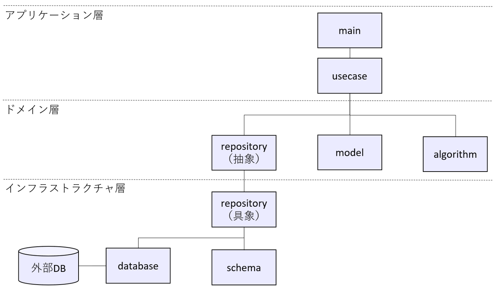

# recommend-movielens

本リポジトリは機械学習パイプライン（データ取得、前処理、学習、評価、予測）を実行する機械学習システムのテンプレートです。テンプレートはレコメンデーションのデータセットを用いて、ユーザIDごとに直近5件の映画の評価値を予測、1000件のユーザごとに評価が高い順でレコメンデーションします。

```sh
      user_id  movie_id  prediction
0           1       362    4.411735
1           1       520    4.215140
2           1       616    4.185415
3           1       122    3.996753
4           1       466    3.996753
...       ...       ...         ...
4995     1053      2028    4.258149
4996     1053      1242    4.245757
4997     1053      2501    4.217269
4998     1053       457    4.192939
4999     1053      5418    4.052528
```


## データ

データは[MovieLens 10M Dataset](https://files.grouplens.org/datasets/movielens/ml-10m.zip)の映画評価データを使用します。

- テンプレートは過去実績の映画の評価値（レビュー）を学習、ユーザごとに直近に評価した5件の評価値を予測します。

- データセットはユーザID/映画IDごとの評価値（ratings）、映画IDごとの映画情報（movies）、ユーザID/映画IDごとのタグ情報（tags）の3つです。
  - `ratings`: ユーザID`user_id`、映画ID`movie_id`ごとの評価値`rating`と入力日時`timestamp`を格納したトランザクションデータ

  - `movies`: 映画ID`movie_id`ごとのタイトル`title`と映画ジャンル`genre`を持つマスタデータ 
  
  - `tags`: ユーザID`user_id`、映画ID`movie_id`ごとにユーザが入力したタグ情報`tag`と入力日時`timestamp`を格納したマスタデータ


- ratingsのレコード件数は100万件を超えますが、テンプレートは処理高速化のため、ユーザIDで件数を絞った約13万件のデモデータを使用します。

- デモデータは[MovieLens 10M Dataset](https://files.grouplens.org/datasets/movielens/ml-10m.zip)を以下の仕様で加工し、[data](./data/)に格納済みです。デモデータの作成方法は[notebook](./notebook/)を参照してください。
  - `ratings_demo.csv`
    - 元ファイルは`ratings.dat`
    - `user_id`を1000件で絞り込み
    - ヘッダ列を付与
  - `movies_demo.csv`
    - 元ファイルは`movies.dat`
    - ヘッダ列を付与
  - `tags_demo.csv`
    - 元ファイルは`tags.dat`
    - ヘッダ列を付与

 - 学習はcsvファイルを直接利用するのではなく、データベース(DB)に登録します。スキーマは[tables.sql](./data/tables.sql)で定義しています。


## Components

テンプレートは以下のコンポーネントで構成されています。

- PostgreSQL database: データを管理するデータベース。テンプレートで使用するデータおよびMLflow tracking serverのデータを記録する。
- [mlflow](./mlflow/): 機械学習の学習、評価、予測を記録し、webブラウザで結果を表示します。
- [data_registration](./data_registration/): [MovieLens 10M Dataset](https://files.grouplens.org/datasets/movielens/ml-10m.zip)のデータをPostgreSQLに登録するバッチ処理。
- [machine_learning](./machine_learning/): 機械学習開発のためのテンプレートとして例示したプログラム。PostgreSQLからデータを取得し、前処理、学習、評価、予測を実行し、記録をMLflow tracking serverに記録する。


## machine_learningの構成

[machine_learning](./machine_learning/)は主に以下のツールを使用しています。他にも補助的なライブラリは使用していますが、煩雑になるため省略しています。機械学習で用いる各種パラメータは[hydra](machine_learning/hydra/)で管理します。


- 機械学習
  - [pandas](https://pandas.pydata.org/): データフレームのライブラリ。本テンプレートで使用するデータは基本的にpandas DataFrame形式で管理される。
  - [pandera](https://pandera.readthedocs.io/en/stable/): pandas DataFrameのデータを検査するライブラリ
  - [pydantic](https://docs.pydantic.dev/latest/): 外部データ（データベース）の読み込み時にデータ型チェックするライブラリ
  - [scikit-learn](https://scikit-learn.org/stable/): テーブルデータの機械学習の前処理及びアルゴリズムを提供するライブラリ
  - [LightGBM](https://lightgbm.readthedocs.io/en/latest/index.html): 勾配ブースティングのアルゴリズムを提供するライブラリ、実装はscikit-learn APIを使用する。
- 機械学習の管理
  - [MLflow](https://mlflow.org/): 機械学習の学習パラメータ及び実行結果を管理するライブラリ
  - [Hydra](https://hydra.cc/): 機械学習のパラメータを管理するライブラリ
- リポジトリのライブラリ管理
  - [poetry](https://python-poetry.org/): Pythonのライブラリを管理する。

[machine_learning](./machine_learning/)のプログラムはレイヤードアーキテクチャを採用。クラスを抽象クラスと具象クラスに分けて実装、コンポーネントの依存が一方向になるよう整理しています。
プログラムは以下のコンポーネントで構成されています。

- [main.py](machine_learning/src/main.py): クラスを初期化し、usecaseのメソッドを実行
- [usecase](machine_learning/src/usecase/): 機械学習パイプラインの各処理（データ取得、前処理、学習、評価、予測）
- [domain](machine_learning/src/domain/): usecase間で受け渡すドメインオブジェクトのデータ型
- [ml_algos](machine_learning/src/ml_algos/): 機械学習の各種アルゴリズム
- [repository](machine_learning/src/repository/): データベースへのリクエスト
- [schema](machine_learning/src/schema/): データベースから取得するデータ型
- [infrastructure](machine_learning/src/infrastructure/): 外部データベースへのアクセス


（注）図はrepositoryだけ具象と抽象を分けて記載してますが、infrastructureとml_algosも具象クラスと抽象クラスに分けて実装しています。

## Requirements

- Docker
- Docker compose
- Poetry（ライブラリ更新時に必要、処理実行するだけであれば不要）
- makeコマンドの実行環境

```sh
# makeのインストール(実行時にsudoパスワードを入力)
$ sudo apt update
$ sudo apt install make
$ make --version
GNU Make 4.3
```

## Getting started

### 1. Docker imageのビルド
- 本リポジトリのルートディレクトリに移動します。

```sh
# 現在のディレクトリの表示(「/xxx/repository」はユーザにより異なります。)
$ pwd
/home/xxx/repository/recommend-movielens
```

- Dockerファイルは3つあり、[makefile](./makefile)の`make build_all`は全てのDockerをまとめてビルドします。

```sh
# 全てのDockerfileを一括でビルド
$ make build_all
```

- Dockerファイルは個別にビルドすることも可能です。

```sh
# data_registrationのビルド
$ make build_data_registration
docker build \
        --platform linux/amd64 \
        -t recommend_movielens:recommend_movielens_data_registration_1.0.0 \
        -f /home/xxx/repository/recommend-movielens/data_registration/Dockerfile \

# machine_learningのビルド
$ make build_machine_learning
docker build \
        --platform linux/amd64 \
        -t recommend_movielens:recommend_movielens_machine_learning_1.0.0 \
        -f /home/xxx/repository/recommend-movielens/machine_learning/Dockerfile \

# mlflowのビルド
$ make build_mlflow
docker build \
        --platform linux/amd64 \
        -t recommend_movielens:recommend_movielens_mlflow_1.0.0 \
        -f /home/xxx/repository/recommend-movielens/mlflow/Dockerfile \

```

- ビルドしたDocker imageを確認します。

```sh
# Docker imageの確認
$ docker images
REPOSITORY                        TAG                                                      IMAGE ID       CREATED         SIZE
recommend_movielens               recommend_movielens_machine_learning_1.0.0               c8a631462bf2   3 minutes ago   1.05GB
recommend_movielens               recommend_movielens_data_registration_1.0.0              1b4400d21838   4 minutes ago   378MB
recommend_movielens               recommend_movielens_mlflow_1.0.0                         a224d2fdf0e4   6 days ago      837MB
```
### 2. 事前準備

- Docker composeでPosgreSQL database、MLflow、data registration、BIのコンテナを起動します。
- [makefile](./makefile)の`make up`は[docker-compose.yaml](docker-compose.yaml)の処理をまとめて実行します。

```sh
# docker-composeの起動
 $ make up
docker compose \
        -f docker-compose.yaml \
        up -d
[+] Running 4/4
 ✔ Network recommend_movielens  Created                                                                                0.0s
 ✔ Container postgres           Started                                                                                0.1s
 ✔ Container mlflow             Started                                                                                0.2s
 ✔ Container data_registration  Started 
```

- data registrationが学習で使用するデータをPostgreSQL databaseに登録します。登録状況は実行ログをご確認ください。
<details> <summary>DB構築とテーブル登録実行ログ</summary>

```sh
# 起動したDocker containerの確認
$ docker ps -a
CONTAINER ID   IMAGE                                                             COMMAND                  CREATED         STATUS                          PORTS                     NAMES
e0f946dd17f4   recommend_movielens:recommend_movielens_data_registration_1.0.0   "/bin/sh -c 'sleep 1…"   2 minutes ago   Exited (0) About a minute ago                             data_registration
aaf8938d418c   recommend_movielens:recommend_movielens_mlflow_1.0.0              "mlflow server --bac…"   2 minutes ago   Up 2 minutes                    0.0.0.0:15000->5000/tcp   mlflow
f98ad3d5ea65   postgres:14.3                                                     "docker-entrypoint.s…"   2 minutes ago   Up 2 minutes                    0.0.0.0:5432->5432/tcp    postgres

# テーブル登録のログ
$ docker logs -f data_registration/
[2024-08-22 08:17:37,430] [INFO] [__main__] [main.py:56] [main] START data_registration
[2024-08-22 08:17:37,430] [INFO] [__main__] [main.py:57] [main]
options:
tables_filepath: /opt/data/tables.sql
movies_filepath: /opt/data/movies_demo.csv
ratings_filepath: /opt/data/ratings_demo.csv
tags_filepath: /opt/data/tags_demo.csv

[2024-08-22 08:17:37,430] [INFO] [__main__] [main.py:83] [main] create tables
[2024-08-22 08:17:37,432] [DEBUG] [src.infrastructure.database] [database.py:64] [execute_create_query] create query: CREATE TABLE IF NOT EXISTS movies (
    movie_id INTEGER NOT NULL,
    title VARCHAR(255) NOT NULL,
    genre VARCHAR(255) NOT NULL,
    created_at TIMESTAMP WITH TIME ZONE DEFAULT CURRENT_TIMESTAMP NOT NULL,
    PRIMARY KEY (movie_id)
);


CREATE TABLE IF NOT EXISTS ratings (
    user_id INTEGER NOT NULL,
    movie_id INTEGER NOT NULL,
    rating FLOAT NOT NULL,
    timestamp INTEGER NOT NULL,
    created_at TIMESTAMP WITH TIME ZONE DEFAULT CURRENT_TIMESTAMP NOT NULL,
    PRIMARY KEY (user_id, movie_id)
);


CREATE TABLE IF NOT EXISTS tags (
    user_id INTEGER NOT NULL,
    movie_id INTEGER NOT NULL,
    tag VARCHAR(255) NOT NULL,
    timestamp INTEGER NOT NULL,
    created_at TIMESTAMP WITH TIME ZONE DEFAULT CURRENT_TIMESTAMP NOT NULL,
    PRIMARY KEY (user_id, movie_id)
);, parameters: None
[2024-08-22 08:17:37,478] [INFO] [__main__] [main.py:85] [main] done create tables
[2024-08-22 08:17:37,478] [INFO] [__main__] [main.py:87] [main] register movies
[2024-08-22 08:17:37,745] [INFO] [src.usecase.data_register_usecase] [data_register_usecase.py:60] [register_movies] movies: 10000 ...
[2024-08-22 08:17:37,963] [INFO] [src.usecase.data_register_usecase] [data_register_usecase.py:63] [register_movies] movies: 10681 ...
[2024-08-22 08:17:37,965] [INFO] [__main__] [main.py:89] [main] done register movies
[2024-08-22 08:17:37,966] [INFO] [__main__] [main.py:91] [main] register ratings
[2024-08-22 08:17:38,540] [INFO] [src.usecase.data_register_usecase] [data_register_usecase.py:87] [register_ratings] ratings: 10000 ...
[2024-08-22 08:17:39,127] [INFO] [src.usecase.data_register_usecase] [data_register_usecase.py:87] [register_ratings] ratings: 20000 ...
[2024-08-22 08:17:40,054] [INFO] [src.usecase.data_register_usecase] [data_register_usecase.py:87] [register_ratings] ratings: 30000 ...
[2024-08-22 08:17:41,069] [INFO] [src.usecase.data_register_usecase] [data_register_usecase.py:87] [register_ratings] ratings: 40000 ...
[2024-08-22 08:17:42,249] [INFO] [src.usecase.data_register_usecase] [data_register_usecase.py:87] [register_ratings] ratings: 50000 ...
[2024-08-22 08:17:43,551] [INFO] [src.usecase.data_register_usecase] [data_register_usecase.py:87] [register_ratings] ratings: 60000 ...
[2024-08-22 08:17:44,986] [INFO] [src.usecase.data_register_usecase] [data_register_usecase.py:87] [register_ratings] ratings: 70000 ...
[2024-08-22 08:17:46,825] [INFO] [src.usecase.data_register_usecase] [data_register_usecase.py:87] [register_ratings] ratings: 80000 ...
[2024-08-22 08:17:48,771] [INFO] [src.usecase.data_register_usecase] [data_register_usecase.py:87] [register_ratings] ratings: 90000 ...
[2024-08-22 08:17:50,985] [INFO] [src.usecase.data_register_usecase] [data_register_usecase.py:87] [register_ratings] ratings: 100000 ...
[2024-08-22 08:17:53,219] [INFO] [src.usecase.data_register_usecase] [data_register_usecase.py:87] [register_ratings] ratings: 110000 ...
[2024-08-22 08:17:55,801] [INFO] [src.usecase.data_register_usecase] [data_register_usecase.py:87] [register_ratings] ratings: 120000 ...
[2024-08-22 08:17:58,803] [INFO] [src.usecase.data_register_usecase] [data_register_usecase.py:87] [register_ratings] ratings: 130000 ...
[2024-08-22 08:18:01,683] [INFO] [src.usecase.data_register_usecase] [data_register_usecase.py:90] [register_ratings] ratings: 132830 ...
[2024-08-22 08:18:01,723] [INFO] [__main__] [main.py:93] [main] done register ratings
[2024-08-22 08:18:01,723] [INFO] [__main__] [main.py:95] [main] register tags
[2024-08-22 08:18:02,152] [INFO] [src.usecase.data_register_usecase] [data_register_usecase.py:114] [register_tags] tags: 10000 ...
[2024-08-22 08:18:02,642] [INFO] [src.usecase.data_register_usecase] [data_register_usecase.py:114] [register_tags] tags: 20000 ...
[2024-08-22 08:18:03,362] [INFO] [src.usecase.data_register_usecase] [data_register_usecase.py:114] [register_tags] tags: 30000 ...
[2024-08-22 08:18:04,264] [INFO] [src.usecase.data_register_usecase] [data_register_usecase.py:114] [register_tags] tags: 40000 ...
[2024-08-22 08:18:05,536] [INFO] [src.usecase.data_register_usecase] [data_register_usecase.py:114] [register_tags] tags: 50000 ...
[2024-08-22 08:18:06,717] [INFO] [src.usecase.data_register_usecase] [data_register_usecase.py:114] [register_tags] tags: 60000 ...
[2024-08-22 08:18:08,132] [INFO] [src.usecase.data_register_usecase] [data_register_usecase.py:114] [register_tags] tags: 70000 ...
[2024-08-22 08:18:09,937] [INFO] [src.usecase.data_register_usecase] [data_register_usecase.py:114] [register_tags] tags: 80000 ...
[2024-08-22 08:18:12,204] [INFO] [src.usecase.data_register_usecase] [data_register_usecase.py:114] [register_tags] tags: 90000 ...
[2024-08-22 08:18:14,188] [INFO] [src.usecase.data_register_usecase] [data_register_usecase.py:117] [register_tags] tags: 95580 ...
[2024-08-22 08:18:14,218] [INFO] [__main__] [main.py:97] [main] done register tags
[2024-08-22 08:18:14,218] [INFO] [__main__] [main.py:99] [main] DONE data_registration
```
</details>

  - DBにログインして、SQLを実行することもできます。

<details> <summary>DBログインとSQL実行ログ</summary>

```sh
# postgresコンテナに入る
$ docker exec -it postgres bash
root@postgres:/#

# DBログイン　パスワード入力が求められるので　password　を入力
root@postgres:/# psql -h localhost -p 5432 -U postgres recommend_movielens -W
Password:

# テーブル一覧
recommend_movielens=# \dt
          List of relations
 Schema |  Name   | Type  |  Owner
--------+---------+-------+----------
 public | movies  | table | postgres
 public | ratings | table | postgres
 public | tags    | table | postgres
(3 rows)

# SQL実行
recommend_movielens=# select count(*) from ratings ;
 count
--------
 132830
(1 row)

# DBログアウト
recommend_movielens=# \q
# postgresコンテナから抜ける
root@postgres:/# exit
exit
$
```
</details>


### 3. 機械学習パイプラインの実行

- 機械学習パイプラインはDockerコンテナを起動して実行します。[makefile](./makefile)の`run_machine_learning`は機械学習パイプラインのジョブを一度に実行します。

- ジョブ実行は「２．事前準備」のテーブルの登録処理が完了してから実行してください。テーブルへの登録状況は「DB構築とテーブル登録実行ログ」で確認できます。

- 前処理のcsvファイル、モデル、ハイパーパラメータ、予測値のcsvファイルはMLflowに格納します。

- 下記のコマンドはローカルの`hydra`と`src`を使用して実行します。Docker build時点の`hydra`と`src`を使用する場合、以下のマウントを削除して実行してください。
  - -v /home/xxx/repository/recommend-movielens/machine_learning/hydra:/opt/hydra
  - -v /home/xxx/repository/recommend-movielens/machine_learning/src:/opt/src

```sh
$ make run_machine_learning
docker run \
        -it \
        --name machine_learning \
        -e POSTGRES_HOST=postgres \
        -e POSTGRES_PORT=5432 \
        -e POSTGRES_USER=postgres \
        -e POSTGRES_PASSWORD=password \
        -e POSTGRES_DBNAME=recommend_movielens \
        -e MLFLOW_TRACKING_URI=http://mlflow:5000 \
        -e TARGET_CONFIG=default \
        -v /home/xxx/repository/recommend-movielens/machine_learning/hydra:/opt/hydra \
        -v /home/xxx/repository/recommend-movielens/machine_learning/src:/opt/src \
        -v /home/xxx/repository/recommend-movielens/machine_learning/outputs:/opt/outputs \
        --net recommend_movielens \
        recommend_movielens:recommend_movielens_machine_learning_1.0.0 \
        python -m src.main
```

<details> <summary>make run_machine_learning実行ログ</summary>

```sh
$ make run_machine_learning
docker run \
        -it \
        --name machine_learning \
        -e POSTGRES_HOST=postgres \
        -e POSTGRES_PORT=5432 \
        -e POSTGRES_USER=postgres \
        -e POSTGRES_PASSWORD=password \
        -e POSTGRES_DBNAME=recommend_movielens \
        -e MLFLOW_TRACKING_URI=http://mlflow:5000 \
        -e TARGET_CONFIG=default \
        -v /home/takuya/repository/recommend-movielens/machine_learning/hydra:/opt/hydra \
        -v /home/takuya/repository/recommend-movielens/machine_learning/src:/opt/src \
        -v /home/takuya/repository/recommend-movielens/machine_learning/outputs:/opt/outputs \
        --net recommend_movielens \
        recommend_movielens:recommend_movielens_machine_learning_1.0.0 \
        python -m src.main
/usr/local/lib/python3.10/site-packages/hydra/_internal/hydra.py:119: UserWarning: Future Hydra versions will no longer change working directory at job runtime by default.
See https://hydra.cc/docs/1.2/upgrades/1.1_to_1.2/changes_to_job_working_dir/ for more information.
  ret = run_job(
[2024-08-25 06:27:54,176] [INFO] [__main__] [main.py:32] [main] START machine_learning...
[2024-08-25 06:27:54,177] [INFO] [__main__] [main.py:33] [main] config: {'name': 'recommend_movielens', 'model': {'name': 'lightgbm_regression', 'params': {'boosting_type': 'gbdt', 'n_estimators': 1000, 'objective': 'rmse', 'metric': 'rmse', 'learning_rate': 0.03, 'num_leaves': 31, 'min_data_in_leaf': 20, 'random_state': 42, 'importance_type': 'gain'}, 'train_params': {'early_stopping_rounds': 10, 'log_evaluation': 10}}, 'period': {'validation': {'user_recency_records': 5}}}
[2024-08-25 06:27:54,177] [INFO] [__main__] [main.py:37] [main] current working directory: /opt/outputs/2024-08-25/06-27-54
[2024-08-25 06:27:54,177] [INFO] [__main__] [main.py:38] [main] run_name: 2024-08-25-06-27-54
[2024-08-25 06:27:54,177] [INFO] [__main__] [main.py:39] [main] parameters:
    validation_records: 5

2024/08/25 06:27:54 WARNING mlflow.utils.git_utils: Failed to import Git (the Git executable is probably not on your PATH), so Git SHA is not available. Error: Failed to initialize: Bad git executable.
The git executable must be specified in one of the following ways:
    - be included in your $PATH
    - be set via $GIT_PYTHON_GIT_EXECUTABLE
    - explicitly set via git.refresh(<full-path-to-git-executable>)

All git commands will error until this is rectified.

This initial message can be silenced or aggravated in the future by setting the
$GIT_PYTHON_REFRESH environment variable. Use one of the following values:
    - quiet|q|silence|s|silent|none|n|0: for no message or exception
    - warn|w|warning|log|l|1: for a warning message (logging level CRITICAL, displayed by default)
    - error|e|exception|raise|r|2: for a raised exception

Example:
    export GIT_PYTHON_REFRESH=quiet

[2024-08-25 06:27:54,266] [INFO] [src.usecase.data_loader_usecase] [data_loader_usecase.py:43] [load_dataset] load data from database
[2024-08-25 06:27:54,355] [INFO] [src.usecase.data_loader_usecase] [data_loader_usecase.py:96] [load_movies_data] done loading 10000...
[2024-08-25 06:27:54,371] [INFO] [src.usecase.data_loader_usecase] [data_loader_usecase.py:96] [load_movies_data] done loading 10681...
[2024-08-25 06:27:54,613] [INFO] [src.usecase.data_loader_usecase] [data_loader_usecase.py:118] [load_ratings_data] done loading 10000...
[2024-08-25 06:27:54,717] [INFO] [src.usecase.data_loader_usecase] [data_loader_usecase.py:118] [load_ratings_data] done loading 20000...
[2024-08-25 06:27:54,817] [INFO] [src.usecase.data_loader_usecase] [data_loader_usecase.py:118] [load_ratings_data] done loading 30000...
[2024-08-25 06:27:54,989] [INFO] [src.usecase.data_loader_usecase] [data_loader_usecase.py:118] [load_ratings_data] done loading 40000...
[2024-08-25 06:27:55,094] [INFO] [src.usecase.data_loader_usecase] [data_loader_usecase.py:118] [load_ratings_data] done loading 50000...
[2024-08-25 06:27:55,270] [INFO] [src.usecase.data_loader_usecase] [data_loader_usecase.py:118] [load_ratings_data] done loading 60000...
[2024-08-25 06:27:55,381] [INFO] [src.usecase.data_loader_usecase] [data_loader_usecase.py:118] [load_ratings_data] done loading 70000...
[2024-08-25 06:27:55,486] [INFO] [src.usecase.data_loader_usecase] [data_loader_usecase.py:118] [load_ratings_data] done loading 80000...
[2024-08-25 06:27:55,689] [INFO] [src.usecase.data_loader_usecase] [data_loader_usecase.py:118] [load_ratings_data] done loading 90000...
[2024-08-25 06:27:55,850] [INFO] [src.usecase.data_loader_usecase] [data_loader_usecase.py:118] [load_ratings_data] done loading 100000...
[2024-08-25 06:27:55,977] [INFO] [src.usecase.data_loader_usecase] [data_loader_usecase.py:118] [load_ratings_data] done loading 110000...
[2024-08-25 06:27:56,165] [INFO] [src.usecase.data_loader_usecase] [data_loader_usecase.py:118] [load_ratings_data] done loading 120000...
[2024-08-25 06:27:56,271] [INFO] [src.usecase.data_loader_usecase] [data_loader_usecase.py:118] [load_ratings_data] done loading 130000...
[2024-08-25 06:27:56,317] [INFO] [src.usecase.data_loader_usecase] [data_loader_usecase.py:118] [load_ratings_data] done loading 132830...
[2024-08-25 06:27:57,189] [INFO] [src.usecase.data_loader_usecase] [data_loader_usecase.py:140] [load_tags_data] done loading 10000...
[2024-08-25 06:27:57,287] [INFO] [src.usecase.data_loader_usecase] [data_loader_usecase.py:140] [load_tags_data] done loading 20000...
[2024-08-25 06:27:57,485] [INFO] [src.usecase.data_loader_usecase] [data_loader_usecase.py:140] [load_tags_data] done loading 30000...
[2024-08-25 06:27:57,588] [INFO] [src.usecase.data_loader_usecase] [data_loader_usecase.py:140] [load_tags_data] done loading 40000...
[2024-08-25 06:27:57,685] [INFO] [src.usecase.data_loader_usecase] [data_loader_usecase.py:140] [load_tags_data] done loading 50000...
[2024-08-25 06:27:57,749] [INFO] [src.usecase.data_loader_usecase] [data_loader_usecase.py:140] [load_tags_data] done loading 55484...
[2024-08-25 06:27:58,340] [INFO] [src.usecase.data_loader_usecase] [data_loader_usecase.py:61] [load_dataset] done dataload
[2024-08-25 06:27:58,347] [INFO] [src.usecase.data_loader_usecase] [data_loader_usecase.py:62] [load_dataset] load ratings:
        user_id  movie_id  rating   timestamp
0             1       122     5.0   838985046
1             1       185     5.0   838983525
2             1       231     5.0   838983392
3             1       292     5.0   838983421
4             1       316     5.0   838983392
...         ...       ...     ...         ...
132825     1053     33794     5.0  1134008301
132826     1053     34162     5.0  1134007983
132827     1053     34319     3.5  1134007773
132828     1053     35836     5.0  1134008021
132829     1053     38038     4.0  1134008024

[132830 rows x 4 columns]

[2024-08-25 06:27:58,357] [INFO] [src.usecase.data_loader_usecase] [data_loader_usecase.py:67] [load_dataset] load movies_tags:
       movie_id  ...                                                tag
0             1  ...  [pixar, pixar, pixar, animation, animated, toy...
1             2  ...  [for children, game, animals, joe johnston, ro...
2             3  ...  [funniest movies, comedinha de velhinhos engra...
3             4  ...                                       [girl movie]
4             5  ...  [steve martin, pregnancy, steve martin, family...
...         ...  ...                                                ...
10676     65088  ...                                                NaN
10677     65091  ...                                                NaN
10678     65126  ...                   [chuck palahniuk, based on book]
10679     65130  ...                                        [toplist08]
10680     65133  ...                                                NaN

[10681 rows x 4 columns]

[2024-08-25 06:27:58,628] [INFO] [src.usecase.preprocess_usecase] [preprocess_usecase.py:47] [preprocess_dataset] done split records
[2024-08-25 06:27:58,634] [INFO] [src.usecase.preprocess_usecase] [preprocess_usecase.py:48] [preprocess_dataset] train ratings:
        user_id  movie_id  rating   timestamp  timestamp_rank
0             1       594     5.0   838984679               6
1             1       370     5.0   838984596               7
2             1       355     5.0   838984474               8
3             1       539     5.0   838984068               9
4             1       586     5.0   838984068              10
...         ...       ...     ...         ...             ...
127825     1053      2194     4.0  1134007197             142
127826     1053      2302     4.5  1134007192             143
127827     1053      4886     5.0  1134007190             144
127828     1053      3147     3.0  1134007182             145
127829     1053      1094     0.5  1134007179             146

[127830 rows x 5 columns]
column:
Index(['user_id', 'movie_id', 'rating', 'timestamp', 'timestamp_rank'], dtype='object')
type:
user_id             int64
movie_id            int64
rating            float64
timestamp           int64
timestamp_rank      int64
dtype: object

[2024-08-25 06:27:58,642] [INFO] [src.usecase.preprocess_usecase] [preprocess_usecase.py:58] [preprocess_dataset] test ratings:
      user_id  movie_id  rating   timestamp  timestamp_rank
0           1       122     5.0   838985046               1
1           1       616     5.0   838984941               2
2           1       362     5.0   838984885               3
3           1       466     5.0   838984679               4
4           1       520     5.0   838984679               5
...       ...       ...     ...         ...             ...
4995     1053      1242     5.0  1134008464               1
4996     1053      2501     5.0  1134008462               2
4997     1053       457     4.5  1134008458               3
4998     1053      2028     5.0  1134008444               4
4999     1053      5418     4.5  1134008441               5

[5000 rows x 5 columns]
column:
Index(['user_id', 'movie_id', 'rating', 'timestamp', 'timestamp_rank'], dtype='object')
type:
user_id             int64
movie_id            int64
rating            float64
timestamp           int64
timestamp_rank      int64
dtype: object

[2024-08-25 06:27:58,746] [INFO] [src.ml_algos.preprocess] [preprocess.py:58] [run] rating data extracted:
        u_min  m_min  u_max  m_max    u_mean    m_mean
0         5.0    0.5    5.0    5.0  5.000000  3.604839
1         5.0    0.5    5.0    5.0  5.000000  3.009091
2         5.0    0.5    5.0    5.0  5.000000  2.534483
3         5.0    0.5    5.0    5.0  5.000000  3.610169
4         5.0    0.5    5.0    5.0  5.000000  3.069820
...       ...    ...    ...    ...       ...       ...
127825    0.5    0.5    5.0    5.0  4.117021  3.851562
127826    0.5    0.5    5.0    5.0  4.117021  3.588785
127827    0.5    1.0    5.0    5.0  4.117021  3.899225
127828    0.5    2.0    5.0    5.0  4.117021  4.088496
127829    0.5    0.5    5.0    5.0  4.117021  3.848214

[127830 rows x 6 columns]
column:
Index(['u_min', 'm_min', 'u_max', 'm_max', 'u_mean', 'm_mean'], dtype='object')
type:
u_min     float64
m_min     float64
u_max     float64
m_max     float64
u_mean    float64
m_mean    float64
dtype: object

[2024-08-25 06:27:58,816] [INFO] [src.ml_algos.preprocess] [preprocess.py:58] [run] rating data extracted:
      u_min  m_min  u_max  m_max    u_mean    m_mean
0       5.0    1.0    5.0    4.5  5.000000  2.852941
1       5.0    2.0    5.0    5.0  5.000000  3.394737
2       5.0    0.5    5.0    5.0  5.000000  3.650000
3       5.0    0.5    5.0    5.0  5.000000  2.824074
4       5.0    0.5    5.0    5.0  5.000000  3.058511
...     ...    ...    ...    ...       ...       ...
4995    0.5    1.0    5.0    5.0  4.117021  4.120192
4996    0.5    2.0    5.0    5.0  4.117021  4.051282
4997    0.5    0.5    5.0    5.0  4.117021  3.997389
4998    0.5    1.5    5.0    5.0  4.117021  4.171986
4999    0.5    1.0    5.0    5.0  4.117021  3.735955

[5000 rows x 6 columns]
column:
Index(['u_min', 'm_min', 'u_max', 'm_max', 'u_mean', 'm_mean'], dtype='object')
type:
u_min     float64
m_min     float64
u_max     float64
m_max     float64
u_mean    float64
m_mean    float64
dtype: object

[2024-08-25 06:27:58,951] [INFO] [src.ml_algos.preprocess] [preprocess.py:108] [run] genre data extracted:
        is_no_genres_listed  is_Action  is_Adventure  is_Animation  ...  is_Sci_Fi  is_Thriller  is_War  is_Western
0                     False      False         False          True  ...      False        False   False       False
1                     False       True         False         False  ...      False        False   False       False
2                     False      False         False         False  ...      False        False   False       False
3                     False      False         False         False  ...      False        False   False       False
4                     False      False         False         False  ...      False        False   False       False
...                     ...        ...           ...           ...  ...        ...          ...     ...         ...
127825                False       True         False         False  ...      False        False   False       False
127826                False      False         False         False  ...      False        False   False       False
127827                False      False         False          True  ...      False        False   False       False
127828                False      False         False         False  ...      False        False   False       False
127829                False      False         False         False  ...      False        False    True       False

[127830 rows x 20 columns]
column:
Index(['is_no_genres_listed', 'is_Action', 'is_Adventure', 'is_Animation',
       'is_Children', 'is_Comedy', 'is_Crime', 'is_Documentary', 'is_Drama',
       'is_Fantasy', 'is_Film_Noir', 'is_Horror', 'is_IMAX', 'is_Musical',
       'is_Mystery', 'is_Romance', 'is_Sci_Fi', 'is_Thriller', 'is_War',
       'is_Western'],
      dtype='object')
type:
is_no_genres_listed    bool
is_Action              bool
is_Adventure           bool
is_Animation           bool
is_Children            bool
is_Comedy              bool
is_Crime               bool
is_Documentary         bool
is_Drama               bool
is_Fantasy             bool
is_Film_Noir           bool
is_Horror              bool
is_IMAX                bool
is_Musical             bool
is_Mystery             bool
is_Romance             bool
is_Sci_Fi              bool
is_Thriller            bool
is_War                 bool
is_Western             bool
dtype: object

[2024-08-25 06:27:59,061] [INFO] [src.ml_algos.preprocess] [preprocess.py:108] [run] genre data extracted:
      is_no_genres_listed  is_Action  is_Adventure  is_Animation  ...  is_Sci_Fi  is_Thriller  is_War  is_Western
0                   False      False         False         False  ...      False        False   False       False
1                   False      False         False          True  ...      False        False   False       False
2                   False      False          True         False  ...      False        False   False       False
3                   False       True         False         False  ...      False        False    True       False
4                   False      False         False         False  ...      False        False   False       False
...                   ...        ...           ...           ...  ...        ...          ...     ...         ...
4995                False       True         False         False  ...      False        False    True       False
4996                False      False         False         False  ...      False        False   False       False
4997                False      False         False         False  ...      False         True   False       False
4998                False       True         False         False  ...      False        False    True       False
4999                False       True         False         False  ...      False         True   False       False

[5000 rows x 20 columns]
column:
Index(['is_no_genres_listed', 'is_Action', 'is_Adventure', 'is_Animation',
       'is_Children', 'is_Comedy', 'is_Crime', 'is_Documentary', 'is_Drama',
       'is_Fantasy', 'is_Film_Noir', 'is_Horror', 'is_IMAX', 'is_Musical',
       'is_Mystery', 'is_Romance', 'is_Sci_Fi', 'is_Thriller', 'is_War',
       'is_Western'],
      dtype='object')
type:
is_no_genres_listed    bool
is_Action              bool
is_Adventure           bool
is_Animation           bool
is_Children            bool
is_Comedy              bool
is_Crime               bool
is_Documentary         bool
is_Drama               bool
is_Fantasy             bool
is_Film_Noir           bool
is_Horror              bool
is_IMAX                bool
is_Musical             bool
is_Mystery             bool
is_Romance             bool
is_Sci_Fi              bool
is_Thriller            bool
is_War                 bool
is_Western             bool
dtype: object

[2024-08-25 06:27:59,071] [INFO] [src.usecase.preprocess_usecase] [preprocess_usecase.py:86] [preprocess_dataset] transform training data...
[2024-08-25 06:27:59,291] [INFO] [src.usecase.preprocess_usecase] [preprocess_usecase.py:143] [split_columns] done preprocessing dataset:
x columns:
Index(['u_min', 'm_min', 'u_max', 'm_max', 'u_mean', 'm_mean',
       'is_no_genres_listed', 'is_Action', 'is_Adventure', 'is_Animation',
       'is_Children', 'is_Comedy', 'is_Crime', 'is_Documentary', 'is_Drama',
       'is_Fantasy', 'is_Film_Noir', 'is_Horror', 'is_IMAX', 'is_Musical',
       'is_Mystery', 'is_Romance', 'is_Sci_Fi', 'is_Thriller', 'is_War',
       'is_Western'],
      dtype='object')
x:
        u_min  m_min  u_max  m_max    u_mean    m_mean  ...  is_Mystery  is_Romance  is_Sci_Fi  is_Thriller  is_War  is_Western
0         5.0    0.5    5.0    5.0  5.000000  3.604839  ...       False       False      False        False   False       False
1         5.0    0.5    5.0    5.0  5.000000  3.009091  ...       False       False      False        False   False       False
2         5.0    0.5    5.0    5.0  5.000000  2.534483  ...       False       False      False        False   False       False
3         5.0    0.5    5.0    5.0  5.000000  3.610169  ...       False        True      False        False   False       False
4         5.0    0.5    5.0    5.0  5.000000  3.069820  ...       False       False      False        False   False       False
...       ...    ...    ...    ...       ...       ...  ...         ...         ...        ...          ...     ...
...
127825    0.5    0.5    5.0    5.0  4.117021  3.851562  ...       False       False      False        False   False       False
127826    0.5    0.5    5.0    5.0  4.117021  3.588785  ...       False       False      False        False   False       False
127827    0.5    1.0    5.0    5.0  4.117021  3.899225  ...       False       False      False        False   False       False
127828    0.5    2.0    5.0    5.0  4.117021  4.088496  ...       False       False      False        False   False       False
127829    0.5    0.5    5.0    5.0  4.117021  3.848214  ...       False        True      False        False    True       False

[127830 rows x 26 columns]
y:
        rating
0          5.0
1          5.0
2          5.0
3          5.0
4          5.0
...        ...
127825     4.0
127826     4.5
127827     5.0
127828     3.0
127829     0.5

[127830 rows x 1 columns]

[2024-08-25 06:27:59,291] [INFO] [src.usecase.preprocess_usecase] [preprocess_usecase.py:91] [preprocess_dataset] transform validation data...
[2024-08-25 06:27:59,337] [INFO] [src.usecase.preprocess_usecase] [preprocess_usecase.py:143] [split_columns] done preprocessing dataset:
x columns:
Index(['u_min', 'm_min', 'u_max', 'm_max', 'u_mean', 'm_mean',
       'is_no_genres_listed', 'is_Action', 'is_Adventure', 'is_Animation',
       'is_Children', 'is_Comedy', 'is_Crime', 'is_Documentary', 'is_Drama',
       'is_Fantasy', 'is_Film_Noir', 'is_Horror', 'is_IMAX', 'is_Musical',
       'is_Mystery', 'is_Romance', 'is_Sci_Fi', 'is_Thriller', 'is_War',
       'is_Western'],
      dtype='object')
x:
      u_min  m_min  u_max  m_max    u_mean    m_mean  ...  is_Mystery  is_Romance  is_Sci_Fi  is_Thriller  is_War  is_Western
0       5.0    1.0    5.0    4.5  5.000000  2.852941  ...       False        True      False        False   False       False
1       5.0    2.0    5.0    5.0  5.000000  3.394737  ...       False       False      False        False   False       False
2       5.0    0.5    5.0    5.0  5.000000  3.650000  ...       False        True      False        False   False       False
3       5.0    0.5    5.0    5.0  5.000000  2.824074  ...       False       False      False        False    True       False
4       5.0    0.5    5.0    5.0  5.000000  3.058511  ...       False       False      False        False   False       False
...     ...    ...    ...    ...       ...       ...  ...         ...         ...        ...          ...     ...         ...
4995    0.5    1.0    5.0    5.0  4.117021  4.120192  ...       False       False      False        False    True       False
4996    0.5    2.0    5.0    5.0  4.117021  4.051282  ...       False       False      False        False   False       False
4997    0.5    0.5    5.0    5.0  4.117021  3.997389  ...       False       False      False         True   False       False
4998    0.5    1.5    5.0    5.0  4.117021  4.171986  ...       False       False      False        False    True       False
4999    0.5    1.0    5.0    5.0  4.117021  3.735955  ...       False       False      False         True   False       False

[5000 rows x 26 columns]
y:
      rating
0        5.0
1        5.0
2        5.0
3        5.0
4        5.0
...      ...
4995     5.0
4996     5.0
4997     4.5
4998     5.0
4999     4.5

[5000 rows x 1 columns]

[2024-08-25 06:28:00,804] [INFO] [__main__] [main.py:89] [main] save files
    training data: ['/opt/outputs/2024-08-25/06-27-54/2024-08-25-06-27-54_training_xy_keys.csv', '/opt/outputs/2024-08-25/06-27-54/2024-08-25-06-27-54_training_xy_x.csv', '/opt/outputs/2024-08-25/06-27-54/2024-08-25-06-27-54_training_xy_y.csv']
    validation data: ['/opt/outputs/2024-08-25/06-27-54/2024-08-25-06-27-54_validation_xy_keys.csv', '/opt/outputs/2024-08-25/06-27-54/2024-08-25-06-27-54_validation_xy_x.csv', '/opt/outputs/2024-08-25/06-27-54/2024-08-25-06-27-54_validation_xy_y.csv']

[2024-08-25 06:28:00,822][src.ml_algos.lightgbm_regressor][INFO] - params: {'boosting_type': 'gbdt', 'n_estimators': 1000, 'objective': 'rmse', 'metric': 'rmse', 'learning_rate': 0.05, 'num_leaves': 32, 'subsample': 0.7, 'subsample_freq': 1, 'feature_fraction': 0.8, 'min_data_in_leaf': 50, 'random_state': 123, 'importance_type': 'gain'}
[2024-08-25 06:28:00,824][src.ml_algos.lightgbm_regressor][INFO] - initialized model: LGBMRegressor(feature_fraction=0.8, importance_type='gain', learning_rate=0.05,
              metric='rmse', min_data_in_leaf=50, n_estimators=1000,
              num_leaves=32, objective='rmse', random_state=123, subsample=0.7,
              subsample_freq=1)
[2024-08-25 06:28:00,824][src.ml_algos.lightgbm_regressor][INFO] - params: {'boosting_type': 'gbdt', 'n_estimators': 1000, 'objective': 'rmse', 'metric': 'rmse', 'learning_rate': 0.03, 'num_leaves': 31, 'min_data_in_leaf': 20, 'random_state': 42, 'importance_type': 'gain'}
[2024-08-25 06:28:00,826][src.ml_algos.lightgbm_regressor][INFO] - initialized model: LGBMRegressor(importance_type='gain', learning_rate=0.03, metric='rmse',
              min_data_in_leaf=20, n_estimators=1000, objective='rmse',
              random_state=42)
[2024-08-25 06:28:00,848] [INFO] [src.usecase.training_usecase] [training_usecase.py:17] [train] start training: lightgbm_regression...
[2024-08-25 06:28:00,851][src.ml_algos.lightgbm_regressor][INFO] - start train for model: LGBMRegressor(importance_type='gain', learning_rate=0.03, metric='rmse',
              min_data_in_leaf=20, n_estimators=1000, objective='rmse',
              random_state=42)
[LightGBM] [Warning] min_data_in_leaf is set=20, min_child_samples=20 will be ignored. Current value: min_data_in_leaf=20
[LightGBM] [Warning] min_data_in_leaf is set=20, min_child_samples=20 will be ignored. Current value: min_data_in_leaf=20
[LightGBM] [Info] Auto-choosing row-wise multi-threading, the overhead of testing was 0.015935 seconds.
You can set `force_row_wise=true` to remove the overhead.
And if memory is not enough, you can set `force_col_wise=true`.
[LightGBM] [Info] Total Bins 583
[LightGBM] [Info] Number of data points in the train set: 127830, number of used features: 25
[LightGBM] [Warning] min_data_in_leaf is set=20, min_child_samples=20 will be ignored. Current value: min_data_in_leaf=20
[LightGBM] [Info] Start training from score 3.575151
Training until validation scores don't improve for 10 rounds
[10]    train's rmse: 0.961778  valid's rmse: 1.00979
[20]    train's rmse: 0.907821  valid's rmse: 0.974516
[30]    train's rmse: 0.875909  valid's rmse: 0.956718
[40]    train's rmse: 0.857063  valid's rmse: 0.94846
[50]    train's rmse: 0.845851  valid's rmse: 0.94529
[60]    train's rmse: 0.839025  valid's rmse: 0.944347
Early stopping, best iteration is:
[59]    train's rmse: 0.839564  valid's rmse: 0.944331
[2024-08-25 06:28:01,538] [INFO] [src.usecase.training_usecase] [training_usecase.py:25] [train] done training: lightgbm_regression
[2024-08-25 06:28:01,538] [INFO] [src.usecase.prediction_usecase] [prediction_usecase.py:19] [predict] start prediction: lightgbm_regression...
[LightGBM] [Warning] min_data_in_leaf is set=20, min_child_samples=20 will be ignored. Current value: min_data_in_leaf=20
[2024-08-25 06:28:01,584] [INFO] [src.usecase.prediction_usecase] [prediction_usecase.py:44] [predict] done prediction: lightgbm_regression
[2024-08-25 06:28:01,590] [INFO] [src.usecase.prediction_usecase] [prediction_usecase.py:45] [predict] prediction:
      user_id  timestamp_rank  movie_id  prediction
0           1               1       122    3.996753
1           1               2       616    4.185415
2           1               3       362    4.411735
3           1               4       466    3.996753
4           1               5       520    4.215140
...       ...             ...       ...         ...
4995     1053               1      1242    4.245757
4996     1053               2      2501    4.217269
4997     1053               3       457    4.192939
4998     1053               4      2028    4.258149
4999     1053               5      5418    4.052528

[5000 rows x 4 columns]

[2024-08-25 06:28:01,591] [INFO] [src.usecase.evaluation_usecase] [evaluation_usecase.py:26] [evaluate] start evaluation...
[2024-08-25 06:28:01,603] [INFO] [src.usecase.evaluation_usecase] [evaluation_usecase.py:53] [evaluate] done evaluation
[2024-08-25 06:28:01,610] [INFO] [src.usecase.evaluation_usecase] [evaluation_usecase.py:54] [evaluate] evaluation:
data:
      user_id  timestamp_rank  movie_id  y_true    y_pred
0           1               1       122     5.0  3.996753
1           1               2       616     5.0  4.185415
2           1               3       362     5.0  4.411735
3           1               4       466     5.0  3.996753
4           1               5       520     5.0  4.215140
...       ...             ...       ...     ...       ...
4995     1053               1      1242     5.0  4.245757
4996     1053               2      2501     5.0  4.217269
4997     1053               3       457     4.5  4.192939
4998     1053               4      2028     5.0  4.258149
4999     1053               5      5418     4.5  4.052528

[5000 rows x 5 columns]
mean_absolute_error: 0.7409291996383492
root_mean_squared_error: 0.9443305071336199

[2024-08-25 06:28:01,650] [INFO] [src.usecase.evaluation_usecase] [evaluation_usecase.py:79] [export_feature_importance] feature importances
           feature_name     importance
0                m_mean  562747.602737
1                u_mean  294953.369169
2                 m_max    3318.490997
3                 m_min    2191.249098
4                 u_min    1872.492203
5                 u_max     596.969999
6             is_Action     208.123205
7             is_Sci_Fi      91.145502
8             is_Comedy      51.181301
9              is_Drama      46.069399
10            is_Horror      23.278601
11          is_Children      19.237499
12  is_no_genres_listed       0.000000
13         is_Adventure       0.000000
14         is_Animation       0.000000
15       is_Documentary       0.000000
16           is_Fantasy       0.000000
17             is_Crime       0.000000
18         is_Film_Noir       0.000000
19              is_IMAX       0.000000
20           is_Mystery       0.000000
21           is_Musical       0.000000
22           is_Romance       0.000000
23          is_Thriller       0.000000
24               is_War       0.000000
25           is_Western       0.000000

[2024-08-25 06:28:01,651] [INFO] [src.usecase.prediction_usecase] [prediction_usecase.py:57] [recommend] start recommendation: lightgbm_regression...
[LightGBM] [Warning] min_data_in_leaf is set=20, min_child_samples=20 will be ignored. Current value: min_data_in_leaf=20
[2024-08-25 06:28:01,689] [INFO] [src.usecase.prediction_usecase] [prediction_usecase.py:80] [recommend] done recommendation: lightgbm_regression
[2024-08-25 06:28:01,696] [INFO] [src.usecase.prediction_usecase] [prediction_usecase.py:81] [recommend] recommendation:
      user_id  movie_id  prediction
0           1       362    4.411735
1           1       520    4.215140
2           1       616    4.185415
3           1       122    3.996753
4           1       466    3.996753
...       ...       ...         ...
4995     1053      2028    4.258149
4996     1053      1242    4.245757
4997     1053      2501    4.217269
4998     1053       457    4.192939
4999     1053      5418    4.052528

[5000 rows x 3 columns]

[2024-08-25 06:28:01,697][src.ml_algos.lightgbm_regressor][INFO] - save model: /opt/outputs/2024-08-25/06-27-54/2024-08-25-06-27-54_model.txt
[2024-08-25 06:28:01,757] [INFO] [__main__] [main.py:189] [main] DONE machine learning task for lightgbm_regression: 2024-08-25-06-27-54
[2024-08-25 06:28:01,765] [INFO] [__main__] [main.py:191] [main] DONE machine_learning
```
</details>


### 4. MLflowの確認

- 前処理、学習、評価、評価の結果はMLflowに登録されます
- URL: http://localhost:15000

#### MLflow


#### 学習パラメータ


#### 評価指標（検証データ）


#### 評価値（検証データ）


#### レコメンデーション形式の予測値（検証データ）


### 5. 利用終了時のコンテナ削除

- 削除対象のコンテナを確認します。
```sh
# コンテナの一覧
$ docker ps -a
CONTAINER ID   IMAGE                                                             COMMAND                  CREATED          STATUS                      PORTS                     NAMES
a62110fbdf0f   recommend_movielens:recommend_movielens_machine_learning_1.0.0    "python -m src.main"     13 minutes ago   Exited (0) 12 minutes ago                             machine_learning
e0f946dd17f4   recommend_movielens:recommend_movielens_data_registration_1.0.0   "/bin/sh -c 'sleep 1…"   19 minutes ago   Exited (0) 18 minutes ago                             data_registration
aaf8938d418c   recommend_movielens:recommend_movielens_mlflow_1.0.0              "mlflow server --bac…"   19 minutes ago   Up 19 minutes               0.0.0.0:15000->5000/tcp   mlflow
f98ad3d5ea65   postgres:14.3                                                     "docker-entrypoint.s…"   19 minutes ago   Up 19 minutes               0.0.0.0:5432->5432/tcp    postgres
```

- 「3. 機械学習パイプラインの実行」で作成したコンテナは`docker rm`で削除します。
```sh
# コンテナの削除
$ docker rm machine_learning
machine_learning
```

- 「2. 事前準備」で作成したコンテナは`make down`で削除します。
```sh
# docker-composeの停止
$ make down
docker compose \
        -f docker-compose.yaml \
        down
[+] Running 4/4
 ✔ Container data_registration  Removed                                                                                0.0s
 ✔ Container mlflow             Removed                                                                               10.5s
 ✔ Container postgres           Removed                                                                                0.5s
 ✔ Network recommend_movielens  Removed
```

- コンテナの削除を確認します。
```sh
# コンテナの一覧
$ docker ps -a
CONTAINER ID   IMAGE     COMMAND   CREATED   STATUS    PORTS     NAMES
```

## 使用するデータ範囲の変更

使用するデータや学習、予測の期間は以下で管理することができます。

### data_registrationで登録するデータ

[data_registration](data_registration/)で登録するデータは[docker-compose.yaml](docker-compose.yaml)の`command`で指定しています。

### machine_learningで使用するデータ

[machine_learning](machine_learning/)で使用するデータは[hydraディレクトリ](machine_learning/hydra/)配下にある[default.yaml](machine_learning/hydra/default.yaml)で定義しています。
本データは時系列データであるため、学習、評価で使用するデータは期間で指定しています。期間の指定は[default.yaml](machine_learning/hydra/default.yaml)の`period`で定義します。

期間を指定するパラメータ：
- user_recency_records: 1ユーザごとの評価に使用するレコード件数


使用するHydraのconfigファイルはmachine_learningを起動する`docker run`のコマンドに環境変数`TARGET_CONFIG`に指定します。

```sh
$ make run_machine_learning
docker run \
        -it \
        --name machine_learning \
        -e POSTGRES_HOST=postgres \
        -e POSTGRES_PORT=5432 \
        -e POSTGRES_USER=postgres \
        -e POSTGRES_PASSWORD=password \
        -e POSTGRES_DBNAME=recommend_movielens \
        -e MLFLOW_TRACKING_URI=http://mlflow:5000 \
        -e TARGET_CONFIG=default \
        -v /home/xxx/repository/recommend-movielens/machine_learning/hydra:/opt/hydra \
        -v /home/xxx/repository/recommend-movielens/machine_learning/src:/opt/src \
        -v /home/xxx/repository/recommend-movielens/machine_learning/outputs:/opt/outputs \
        --net recommend_movielens \
        recommend_movielens:recommend_movielens_machine_learning_1.0.0 \
        python -m src.main
```
